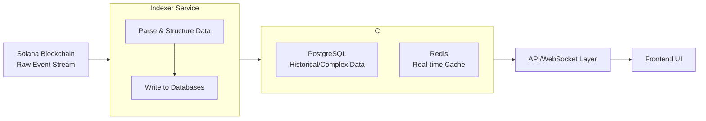

<!-- How Indexer interact with database and smart contract! -->

## 🏗️ System Architecture

```mermaid
flowchart LR
    A[Solana Blockchain<br>Raw Event Stream] --> B[Indexer Service<br>Ingestion Layer];
    subgraph B[Indexer Service]
        B1[Parse & Structure Data] --> B2[Write to Databases];
    end
    
    B --> C[(Database Layer)];
    subgraph C
        C1[PostgreSQL<br>Historical/Complex Data]
        C2[Redis<br>Real-time Cache]
    end
    
    C --> D[API/WebSocket Layer];
    D --> E[Frontend UI];
```